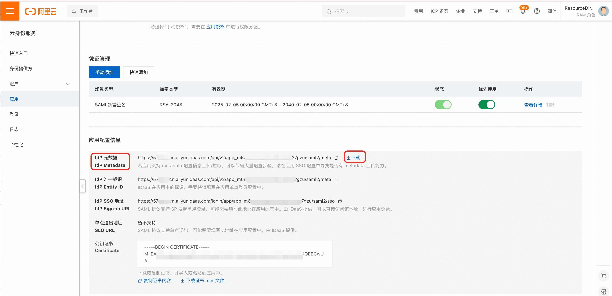
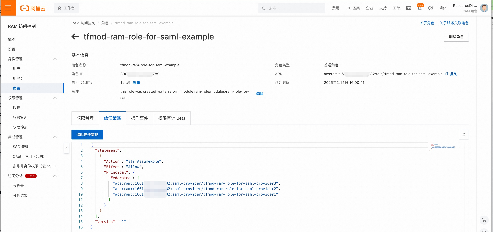
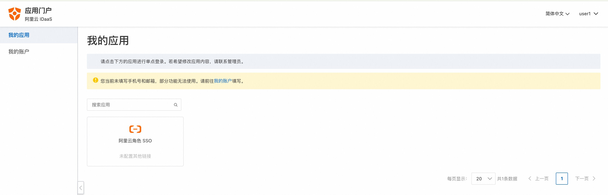
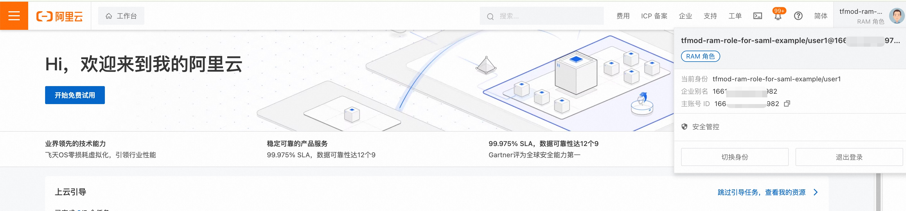

ram-role-for-saml
=================

阿里云访问控制（RAM）支持与外部身份提供商实现 [SAML角色SSO集成](https://help.aliyun.com/zh/ram/user-guide/overview)，现在我们可以使用Terraform Moulde来高效地创建SAML SSO集成有关的RAM资源。

## 用法
本小节将以阿里云的IDaaS作为外部身份提供商，演示如何使用Terraform Module来配置RAM，使之与IDaaS的身份进行SSO集成。

### 准备工作
在开始前，我们需要先准备好以下名称，在配置IDaaS和RAM角色时均需要用到：

1. SAML身份提供商名称，比如：test-idaas-saml-provider
2. RAM角色名称，比如：test-role-for-idaas

### 配置IDaaS
首先，创建IDaaS实例与账户，参考IDaaS官网文档：

+ [IDaaS - 免费开通实例](https://help.aliyun.com/zh/idaas/eiam/getting-started/create-an-instance-for-free)
+ [IDaaS - 创建账户](https://help.aliyun.com/zh/idaas/eiam/getting-started/create-an-account)

然后，创建“阿里云角色SSO”应用，参考IDaaS官网文档 [创建“阿里云角色SSO”应用](https://help.aliyun.com/zh/idaas/eiam/user-guide/alibaba-cloud-role-based-sso)。配置时须注意：

1. 只配置IDaaS资源，不要配置RAM相关资源，RAM资源将会使用Terraform创建。文档中有5个小节，只需完成前两个小节，即：“创建应用”、“配置应用单点登录”；
2. 配置时，务必使用上面准备好的SAML身份提供商名称和RAM角色名称。

配置好后，从IDaaS控制台中下载IdP元数据文件，它是一个XML文档，后面会用它替换掉 Terraform 代码中对应的XML样例。



### 配置RAM (terraform方式)
接下来，我们使用Terraform创建SAML身份提供商与RAM角色。

我们首先需要配置好Terraform的执行环境，具体操作方法可以参考阿里云官网文档：[Terraform 使用入门](https://help.aliyun.com/zh/terraform/getting-started-with-terraform)。


配置好Terraform环境后，添加如下的Terraform代码到你的项目中，其中encodedsaml_metadata_document的值需要修正，具体获取方法见后文。代码中的saml_provider_name和role_name与先前准备的名称保持一致，不要随意修改。

执行 terraform apply 命令，创建SAML身份提供商和RAM角色。

```hcl
# 创建SAML身份提供商
resource "alicloud_ram_saml_provider" "test-saml-provider" {
  description                   = "saml provider for test."

  # SAML身份提供商名称，须与IDaaS中填写的名称保持一致
  saml_provider_name            = "test-idaas-saml-provider"

  # IDaaS SAML IdP元数据XML文档内容
  encodedsaml_metadata_document = base64encode(<<EOF
<?xml version="1.0" encoding="UTF-8"?>
<md:EntityDescriptor xmlns:md="urn:oasis:names:tc:SAML:2.0:metadata"
                     ID="SIMPCp1J9vJt142Dvg5AT2Efcn9JumMe7fau"
                     entityID="https://574b3zcn.aliyunidaas.com/api/v2/app_m6rpawvpeqcjluw7dvyhp37gzu/saml2/meta"
                     validUntil="2125-02-05T05:00:10.578Z">
...
...
...

</md:EntityDescriptor>
EOF
    )
}

# 创建RAM角色
module "ram-role-for-saml-example" {
  source = "../../modules/ram-role-for-saml"

  provider_id = alicloud_ram_saml_provider.test-saml-provider.arn

  # 角色名称，须与IDaaS账户绑定的应用账户同名
  role_name = "test-role-for-idaas"

  # 给角色的授权策略
  managed_system_policy_names = ["AliyunRAMReadOnlyAccess"]
}

```

登陆RAM控制台可以查看他们。





### SSO登陆到阿里云
用前面创建的IDaaS用户登陆，如果不知道如何登陆，可以参考 IDaaS官网文档 [IDaaS - 首次单点登录](https://help.aliyun.com/zh/idaas/eiam/getting-started/logon-and-sso)

登陆后，点击刚刚配置“阿里云角色SSO”应用，便可以跳转到阿里云控制台，登陆的身份即是我们使用Terraform创建的RAM角色。







<!-- 在根目录下运行命令 `terraform-docs markdown . --output-file "./README.md"`，可将所有信息自动填充 -->
<!-- BEGIN_TF_DOCS -->
## Requirements

| Name | Version |
|------|---------|
| <a name="requirement_terraform"></a> [terraform](#requirement\_terraform) | >= 1.0 |
| <a name="requirement_alicloud"></a> [alicloud](#requirement\_alicloud) | >= 1.220.0 |

## Providers

| Name | Version |
|------|---------|
| <a name="provider_alicloud"></a> [alicloud](#provider\_alicloud) | >= 1.220.0 |

## Modules

No modules.

## Resources

| Name | Type |
|------|------|
| [alicloud_ram_role.this](https://registry.terraform.io/providers/aliyun/alicloud/latest/docs/resources/ram_role) | resource |
| [alicloud_ram_role_policy_attachment.custom_role_policies](https://registry.terraform.io/providers/aliyun/alicloud/latest/docs/resources/ram_role_policy_attachment) | resource |
| [alicloud_ram_role_policy_attachment.custom_role_system_policies](https://registry.terraform.io/providers/aliyun/alicloud/latest/docs/resources/ram_role_policy_attachment) | resource |
| [alicloud_caller_identity.current](https://registry.terraform.io/providers/aliyun/alicloud/latest/docs/data-sources/caller_identity) | data source |
| [alicloud_ram_policy_document.assume_role_with_saml](https://registry.terraform.io/providers/aliyun/alicloud/latest/docs/data-sources/ram_policy_document) | data source |

## Inputs

| Name | Description | Type | Default | Required |
|------|-------------|------|---------|:--------:|
| <a name="input_create"></a> [create](#input\_create) | Whether to create a role | `bool` | `false` | no |
| <a name="input_force"></a> [force](#input\_force) | This parameter is used for RAM role force destroy | `bool` | `false` | no |
| <a name="input_managed_custom_policy_names"></a> [managed\_custom\_policy\_names](#input\_managed\_custom\_policy\_names) | List of names of managed policies of Custom type to attach to RAM user | `list(string)` | `[]` | no |
| <a name="input_managed_system_policy_names"></a> [managed\_system\_policy\_names](#input\_managed\_system\_policy\_names) | List of names of managed policies of System type to attach to RAM user | `list(string)` | `[]` | no |
| <a name="input_max_session_duration"></a> [max\_session\_duration](#input\_max\_session\_duration) | Maximum CLI/API session duration in seconds between 3600 and 43200 | `number` | `3600` | no |
| <a name="input_provider_id"></a> [provider\_id](#input\_provider\_id) | ID of the SAML Provider. Use provider\_ids to specify several IDs. | `string` | `""` | no |
| <a name="input_provider_ids"></a> [provider\_ids](#input\_provider\_ids) | List of SAML Provider IDs | `list(string)` | `[]` | no |
| <a name="input_ram_role_description"></a> [ram\_role\_description](#input\_ram\_role\_description) | RAM Role description | `string` | `""` | no |
| <a name="input_role_name"></a> [role\_name](#input\_role\_name) | RAM role name | `string` | `null` | no |

## Outputs

| Name | Description |
|------|-------------|
| <a name="output_role_arn"></a> [role\_arn](#output\_role\_arn) | ARN of RAM role |
| <a name="output_role_id"></a> [role\_id](#output\_role\_id) | ID of RAM role |
| <a name="output_role_name"></a> [role\_name](#output\_role\_name) | Name of RAM role |
<!-- END_TF_DOCS -->
